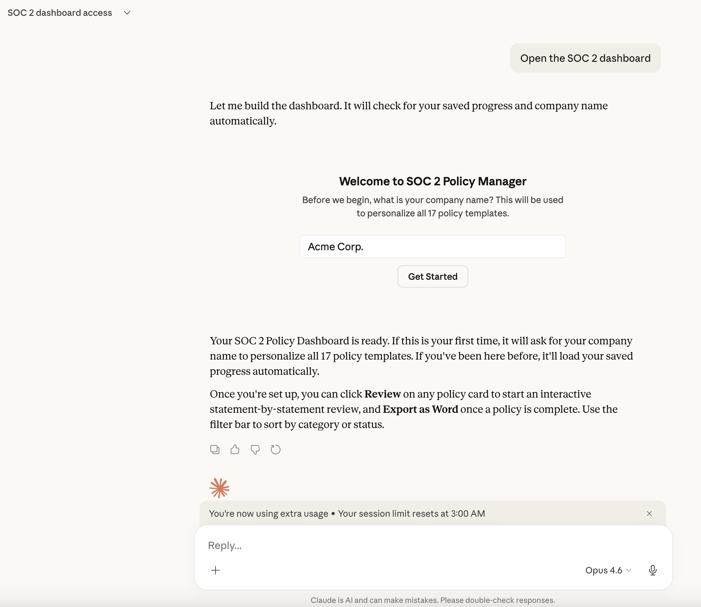
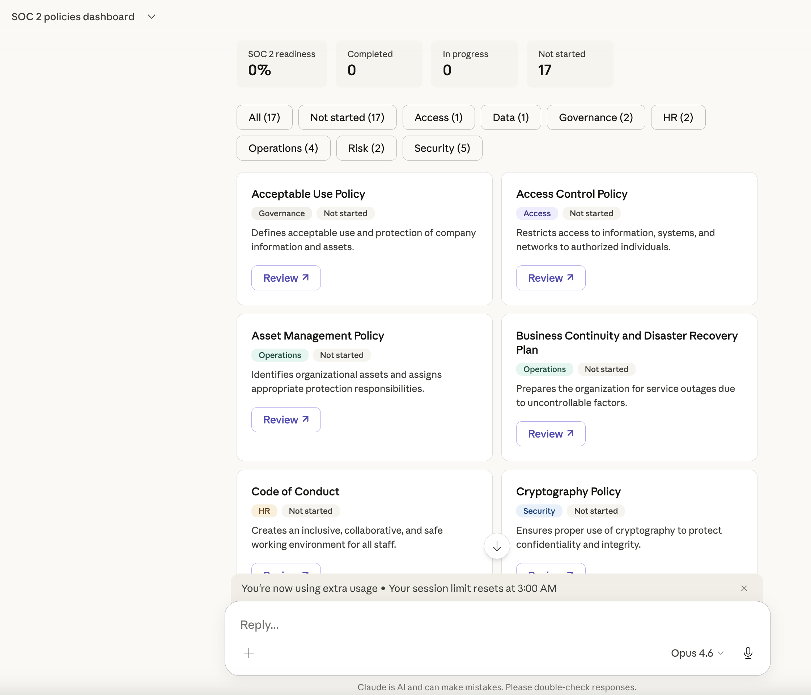
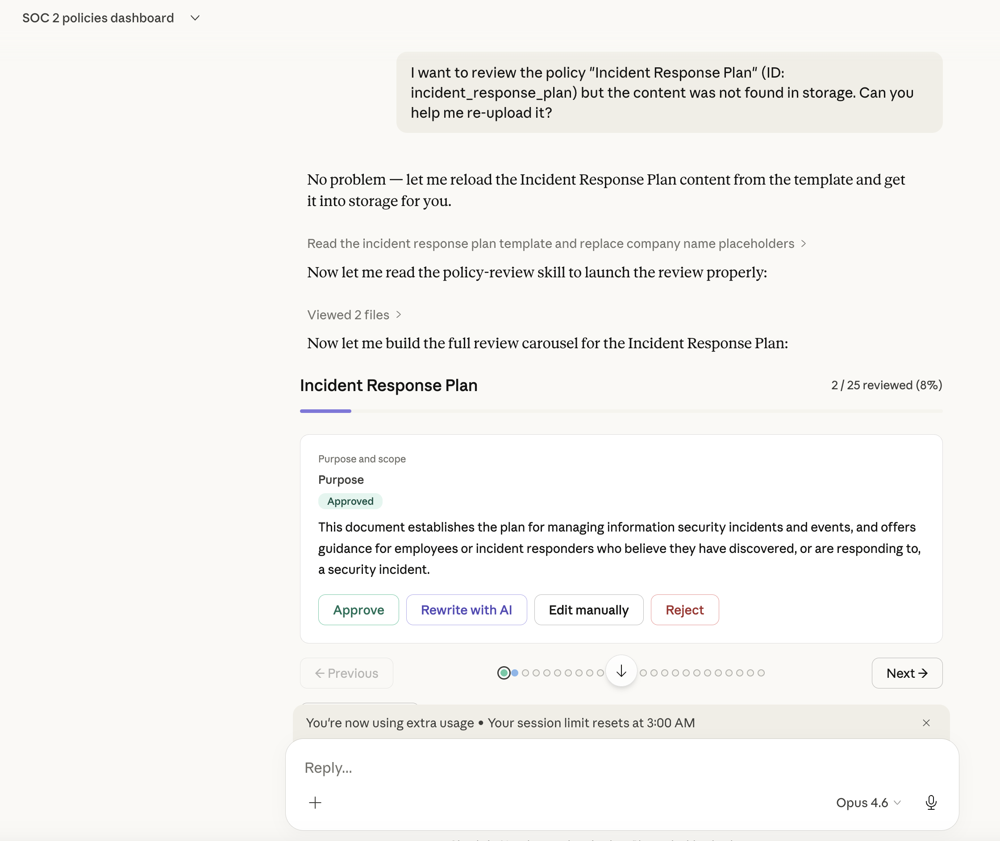

# SOC 2 Policy Skills for Claude

A set of three Claude skills for managing SOC 2 Type II policy documentation — from interactive review to Word export.

> **Requires claude.ai Projects** (web interface).
> These skills use interactive artifact widgets, persistent storage, and file downloads.
> They do **not** work with Claude Code CLI or the VSCode extension.

---

## What's included

| Skill | What it does |
|---|---|
| **soc2-policies** | Interactive card-grid dashboard for managing all 17 bundled SOC 2 policy templates. Tracks review progress across sessions, stores audit history, and orchestrates the other two skills. |
| **policy-review** | Carousel-based review workflow for a single policy document. Step through each statement and approve, reject, or rewrite with AI assistance. Works standalone or launched from the dashboard. |
| **policy-export** | Converts a reviewed, finalized policy (stored as HTML) into a professional Word (.docx) file with title page, table of contents, and version history. |

The three skills form a pipeline:

```
soc2-policies  →  policy-review  →  policy-export
  (overview)       (per-document)    (Word download)
```

### Bundled SOC 2 policy templates

The `soc2-policies` skill ships with 17 ready-to-use templates (in `skills/soc2-policies/references/templates/`):

| Policy | Category |
|---|---|
| Acceptable Use Policy | Governance |
| Access Control Policy | Access |
| Asset Management Policy | Operations |
| Business Continuity and Disaster Recovery Plan | Operations |
| Code of Conduct | HR |
| Cryptography Policy | Security |
| Data Management Policy | Data |
| Human Resources Security Policy | HR |
| Incident Response Plan | Security |
| Information Security Policy | Security |
| Information Security Roles and Responsibilities | Governance |
| Operations Security Policy | Operations |
| Physical Security Policy | Security |
| Removable Media Policy | Security |
| Risk Management Policy | Risk |
| Secure Development Policy | Operations |
| Third-Party Management Policy | Risk |

All templates use `[COMPANY NAME]` placeholders. The dashboard replaces them with your company name on first launch and remembers it across sessions.

---

## Installation

### 1. Build the skill files

```bash
git clone https://github.com/kurianoff/claude-skills-soc2-policies.git
cd claude-skills-soc2-policies
make build
# .skill files are written to dist/
```

Requires `zip` (standard on macOS/Linux).

### 2. Upload to a claude.ai Project

1. Go to [claude.ai](https://claude.ai) and open or create a **Project**.
2. In the Project settings, upload all three `.skill` files from `dist/`:
   - `soc2-policies.skill`
   - `policy-review.skill`
   - `policy-export.skill`
3. Start a conversation in the Project and say:
   ```
   Open the SOC 2 policies dashboard
   ```

---

## Usage

### First launch

Claude will ask for your company name. It is stored in the Project's persistent storage and used to replace all `[COMPANY NAME]` placeholders throughout the policy templates. You won't be asked again.





### Reviewing a policy

1. Open the dashboard → click **Review** on any policy card.
2. The policy-review skill opens a carousel showing one statement at a time.
3. For each statement: **Approve**, **Reject** (with a reason), **Edit manually**, or **Rewrite with AI**.
4. When done, click **Save and return to dashboard** — progress is saved automatically.



### Exporting to Word

Click **Export as Word** on any completed policy card. The policy-export skill generates a `.docx` file with:
- Title page (policy name, company, version, date, author, approver)
- Auto-generated table of contents
- Full policy body
- Rejected statements appendix (if any)
- Version history table

### Uploading your own policies

You can upload your own `.md`, `.docx`, `.pdf`, or `.txt` policy files to the dashboard instead of using the bundled templates. They will be converted and stored as working copies in your Project.

---

## Why claude.ai Projects only?

These skills rely on three capabilities that are specific to the claude.ai web interface:

- **`visualize:show_widget`** — renders interactive HTML/CSS/JS artifacts (the card grid and review carousel)
- **`window.storage`** — persistent key-value storage per Project, survives across sessions
- **`sendPrompt()` / `present_files`** — JavaScript APIs available inside artifact widgets

Claude Code CLI and the VSCode extension do not have an artifact rendering runtime.

---

## Modifying the policy templates

The templates live in [`skills/soc2-policies/references/templates/`](skills/soc2-policies/references/templates/) as HTML files. To edit them:

1. Edit the `.html` files directly in this repo.
2. Run `make build` to repackage into `.skill` files.
3. Re-upload `dist/soc2-policies.skill` to your Project.

---

## Repo structure

```
├── README.md
├── Makefile                          # builds .skill files from source
└── skills/                           # source — browsable, diffable
    ├── soc2-policies/
    │   ├── SKILL.md                  # skill instructions for Claude
    │   └── references/
    │       ├── dashboard-template.md # dashboard widget HTML/CSS/JS
    │       └── templates/            # 17 SOC 2 policy templates
    │           └── *.html
    ├── policy-review/
    │   ├── SKILL.md
    │   └── references/
    │       └── widget-template.md    # review carousel HTML/CSS/JS
    └── policy-export/
        └── SKILL.md
```

---

## Contributing

Policy template improvements, corrections, and new templates are welcome. Edit the HTML files in `skills/soc2-policies/references/templates/` and open a pull request.
